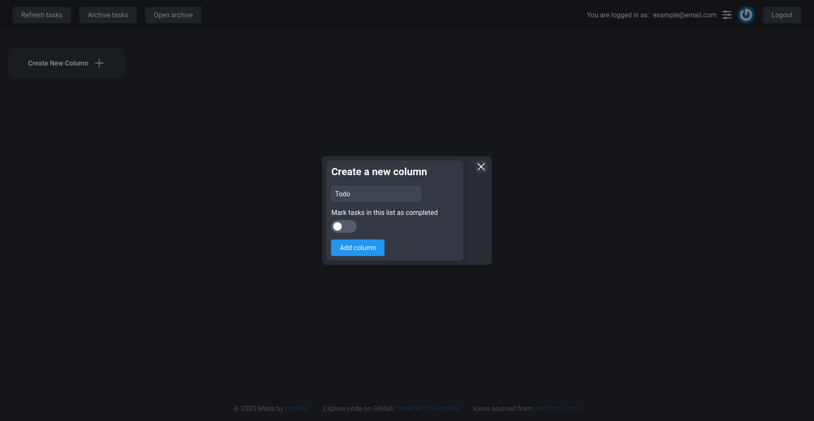
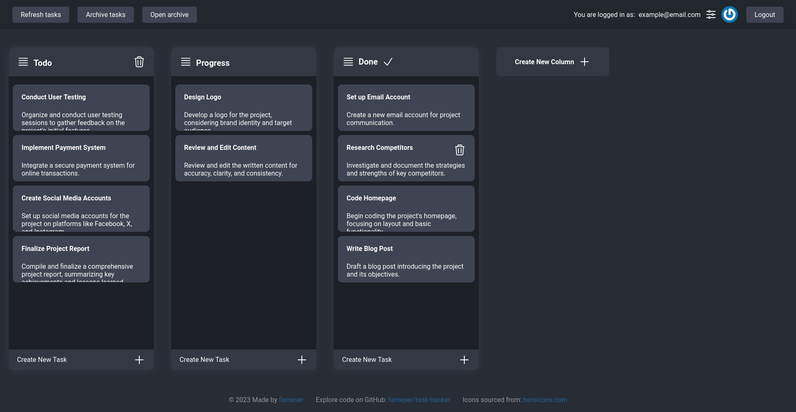
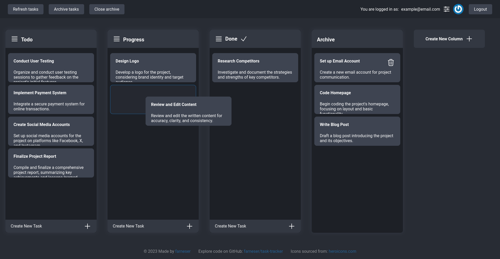

# Task Tracker

## Overview

Task Tracker is a simple yet powerful task management application that leverages microservice architecture to provide a
scalable and efficient solution. The application allows users to organize their tasks in a Trello-like manner, with a
React-based client for a seamless user experience. The backend is implemented using Spring Boot, with additional
features like a scheduler in Kotlin for task automation and an email sender for notifications.

## Technologies Used

- **Client (React):** The front end is built using React, providing a modern and responsive user interface for an
  optimal user experience.

- **Backend API (Spring Boot):** The backend is developed using Spring Boot, offering a robust and scalable foundation
  for managing tasks and user data.

- **Scheduler (Kotlin Spring Boot):** Kotlin is used for creating scheduled tasks to automate certain processes within
  the application, ensuring efficiency and timely updates.

- **Email Sender (Kotlin Spring Boot):** Kotlin Spring Boot is employed for sending email notifications to users,
  keeping them informed about important updates and deadlines.

- **Database (Postgres):** Postgres is used as the relational database to store task-related information securely.

- **Caching (Redis):** Redis is utilized for caching to enhance the performance of the application by storing frequently
  accessed data in-memory.

- **Message Broker (RabbitMQ):** RabbitMQ is employed as a message broker to enable communication and data exchange
  between microservices, ensuring a loosely coupled architecture.

- **Authentication (JWT Tokens):** JSON Web Tokens (JWT) are used for secure user authentication, providing a reliable
  mechanism for verifying the identity of users.

## Microservices

The application comprises the following microservices, each responsible for specific functionalities:

1. [Task Tracker Web API](https://github.com/farneser/task-tracker-api): Implements the core business logic of the
   application, managing tasks and user-related operations.

2. [Task Tracker React Client](https://github.com/farneser/task-tracker-client): Provides a modern and responsive user
   interface for users to interact with the task management system.

3. [Task Tracker Email Service](https://github.com/farneser/task-tracker-email-sender): Manages the sending of email
   notifications, keeping users informed about important updates and deadlines.

4. [Task Tracker Scheduler Service](https://github.com/farneser/task-tracker-scheduler): Implements scheduled tasks to
   automate processes within the application, ensuring efficiency and timely updates.

The microservices are deployed using Docker containers, with the following architecture:

## Technologies Used

* [Spring Boot](https://spring.io/projects/spring-boot): A framework for building Java-based enterprise applications.
* [Kotlin](https://kotlinlang.org/): A modern programming language that works seamlessly with Java on the JVM.
* [Spring Data JPA](https://spring.io/projects/spring-data-jpa): Simplifying data access with JPA.
* [Postgres](https://www.postgresql.org/): A powerful, open-source relational database system.
* [Spring Security](https://spring.io/projects/spring-security): A powerful and customizable authentication and access
  control framework.
* [ModelMapper](https://modelmapper.org/): An object mapping library that automatically maps one object to another.
* [Flyway](https://flywaydb.org/): Database migration tool for Java-based systems.
* [Swagger](https://swagger.io/): A tool for documenting APIs, providing a user interface to interact with your RESTful
  services.
* [React](https://reactjs.org/): A JavaScript library for building user interfaces.
* [TypeScript](https://www.typescriptlang.org/): A superset of JavaScript that adds static typing and other features.

## CI/DI

As part of the project, an automated CI/CD process has been configured using GitHub Actions for each microservice. This
process ensures the automatic creation of Docker images and their upload to a shared repository (Docker Hub) when
changes are made to the master branch.

1. Web API:
    * 
    * 
2. Scheduler:
    * 
    * 
3. Email Sender:
    * 
    * 
4. Client:
    * 
    * 

## Screenshots

